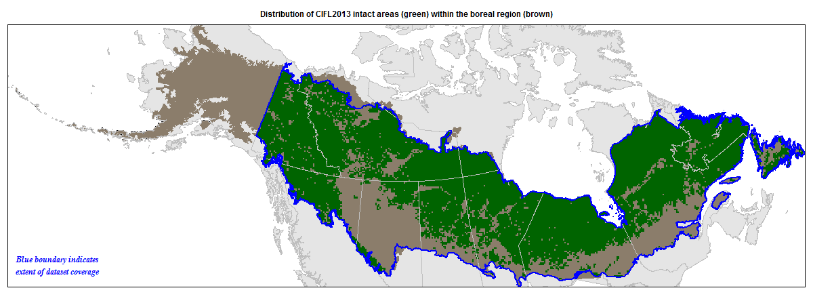
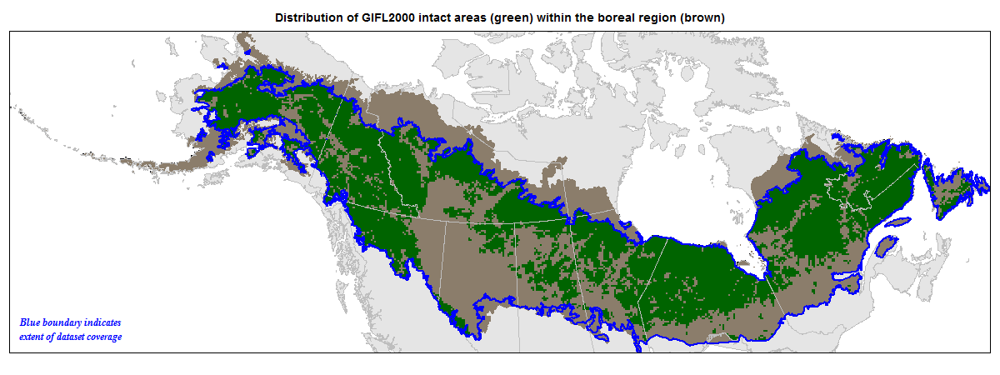
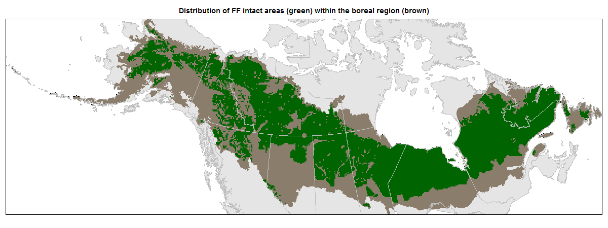
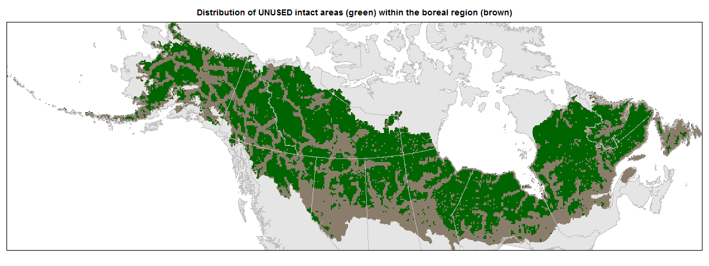
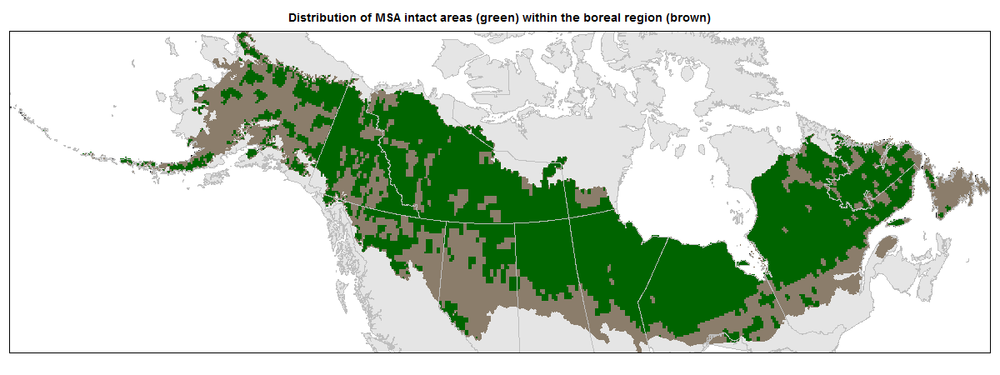

---
output:
  html_document
---

 

**Figure S1.** Distribution of intactness datasets within the boreal region of North America. Intact areas are shown in green overlaying the boreal region in brown. From top to bottom: CIFL2013, CIFL2000, GIFL2013, GIFL2000, HF2009, HF1993, HF, UNUSED, WILD, and MSA.

