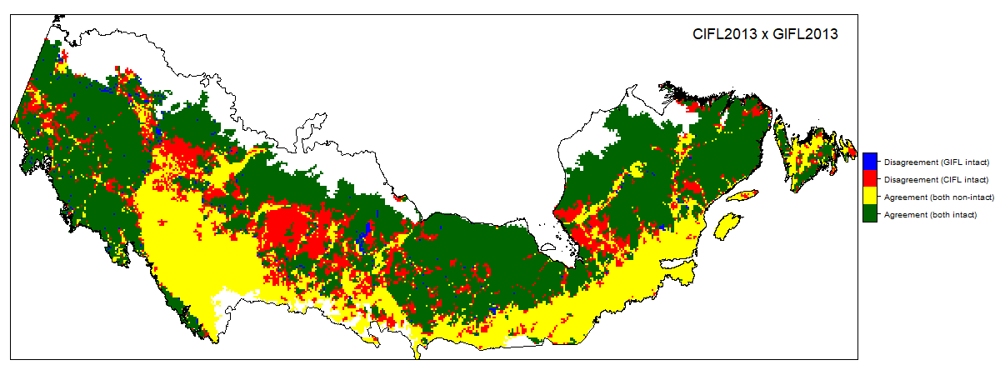
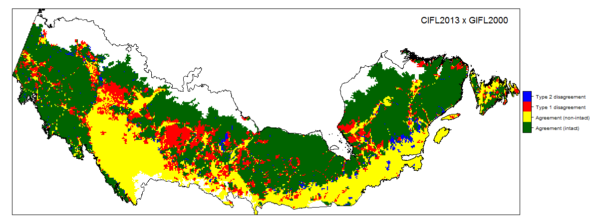
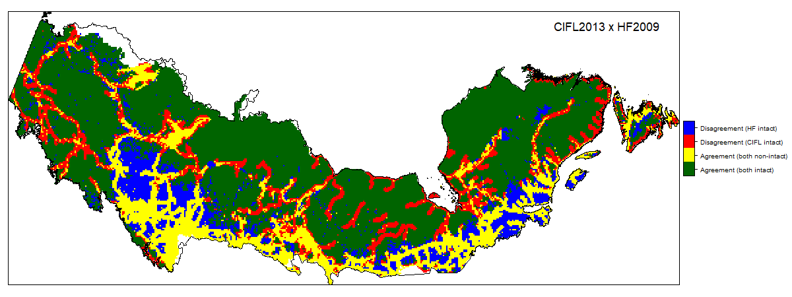
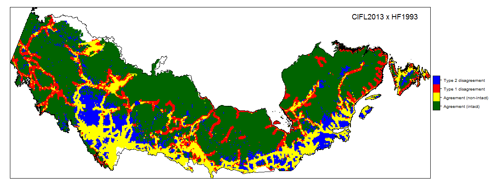
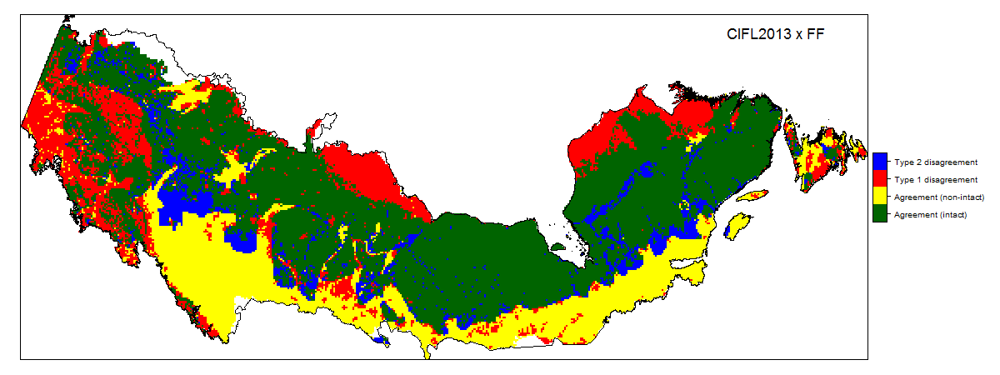
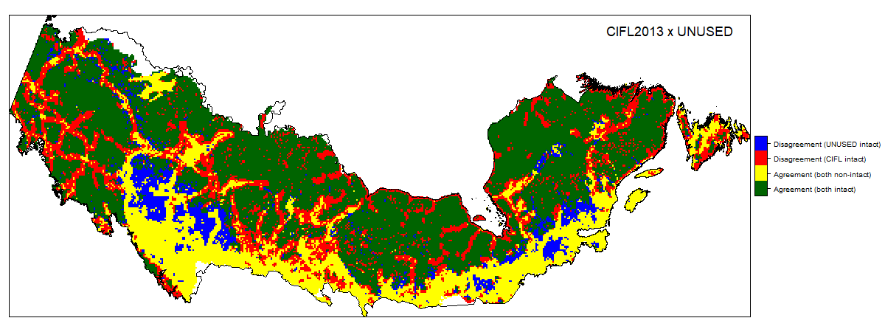
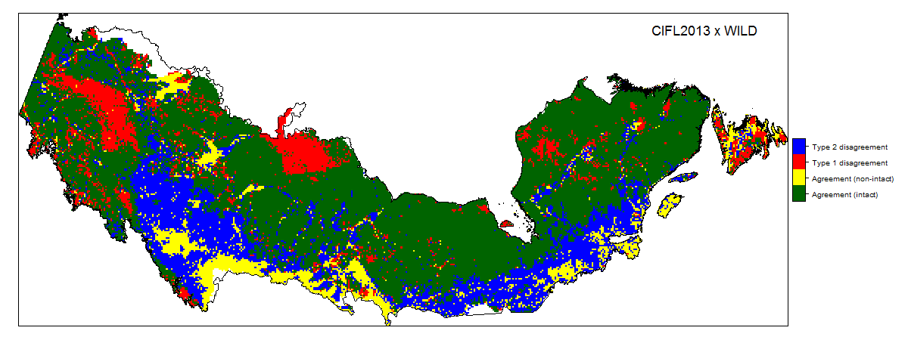
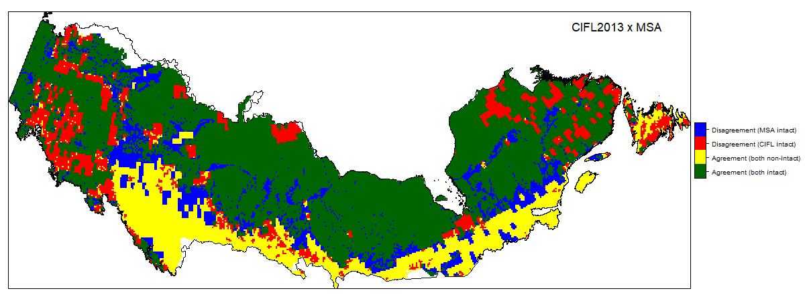

**Figure S2.** Cross-classification of intactness maps within the area of intersection of all datasets. Green and yellow areas indicate areas that are jointly identified as intact or non-intact, respectively. Red areas indicate type 1 disagreements, where the CIFL2013 map identifies intact areas that are not identified by the other map. Blue areas indicate type 2 disagreements, where the other map identifies intact areas that are not identified by the CIFL2013 map. From top to bottom: CIFL2013 x CIFL2000, CIFL2013 x GIFL2013, CIFL2013 x GIFL2000, CIFL2013 x HF2009, CIFL2013 x HF1993, CIFL2013 x F, CIFL2013 x UNUSED, CIFL2013 x WILD, CIFL2013 x MSA.

