**Figure S2.** Cross-classification of intactness maps within the area of intersection of all datasets. Green and yellow areas indicate areas that are jointly identified as intact or non-intact, respectively. Red and blue areas indicate disagreements (see legend for indication of disagreement type).

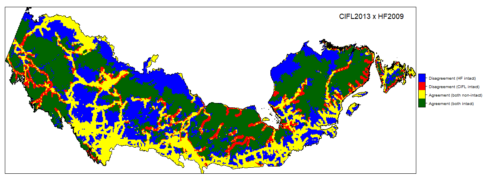

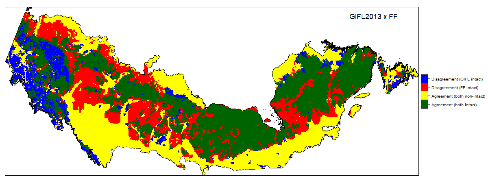

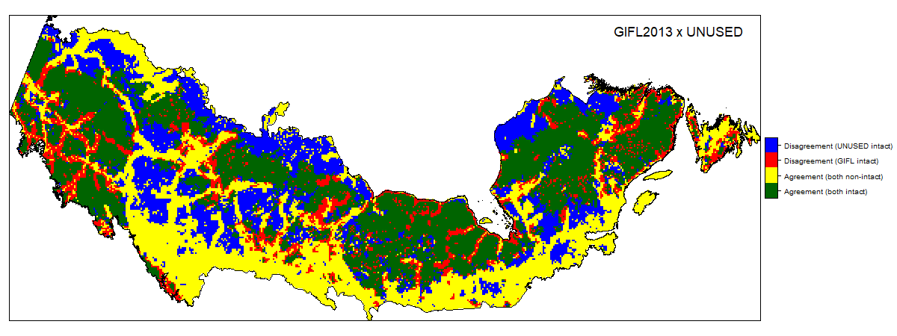

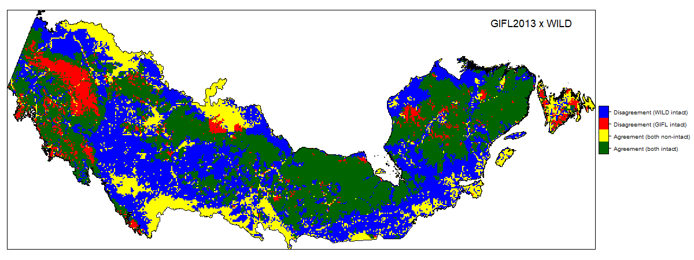

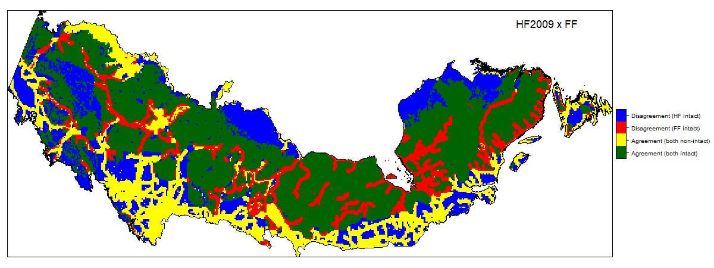

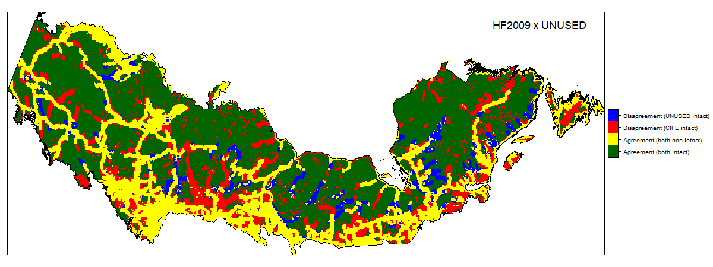

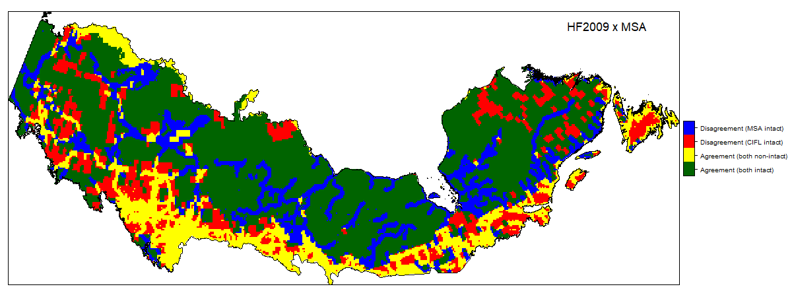

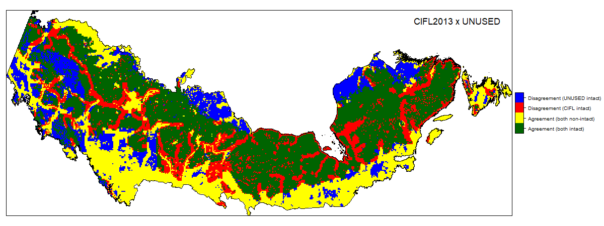

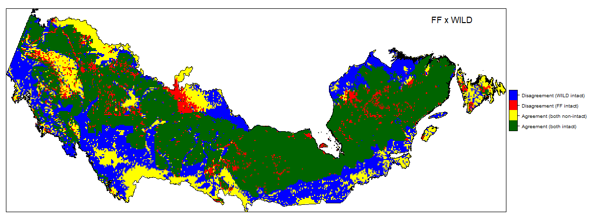

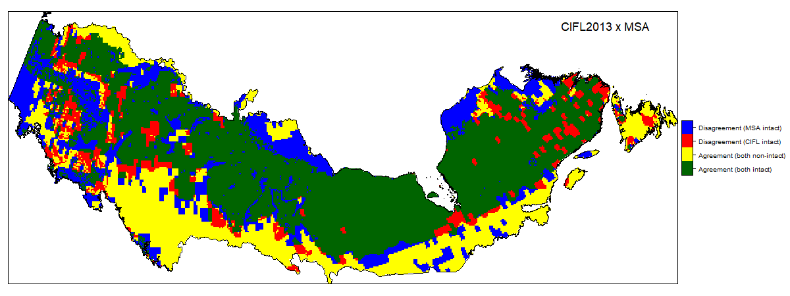

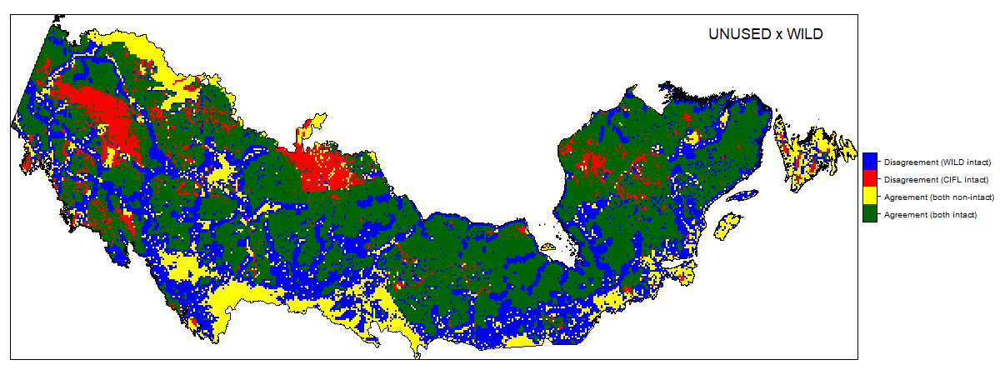

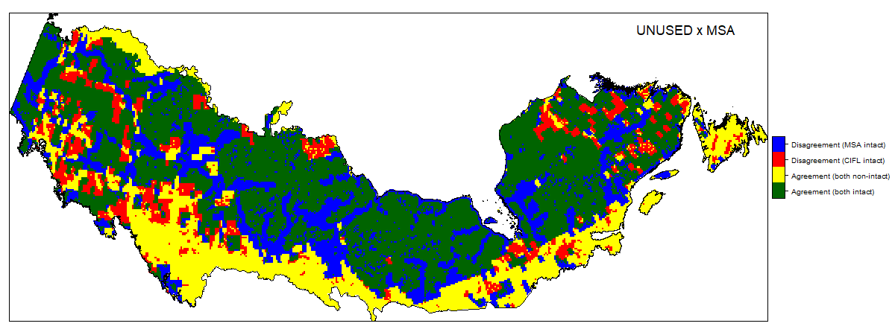

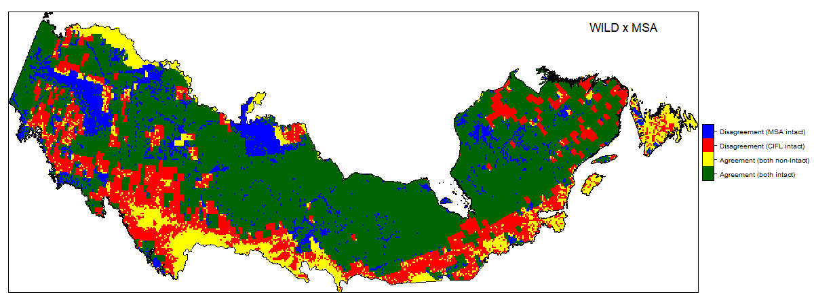
